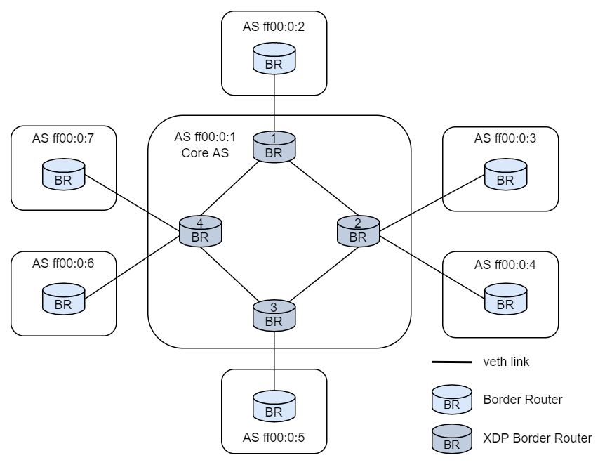

SCION Test Topology
-------------------
The `scion` script in this directory can build a SCION host docker image and set up the following
example topology using docker-compose:

ASes ff00:0:2 to ff00:07 each have their own container called as2 to as7. AS ff00:0:1 consists of
four containers as1br1 to as1br4 each running a border routers. The border routers of AS ff00:0:1
can be replaced/augmented with the XDP router. Internal routing in AS ff00:0:1 is configured through
static routes.

### Requirements
- Docker and docker-compose (https://docs.docker.com/engine/install/ubuntu/)
- jq (`sudo apt install jq`)
- yq (`pip3 install yq`)
- [SCION](https://github.com/netsec-ethz/scion)
- [SCION-Apps](https://github.com/netsec-ethz/scion-apps)

Build SCION and (if you need them) the SCION apps. Set the environment variables `SCION_ROOT`
(default: `$HOME/scion`) and `SCION_APPS` (default: `$HOME/scion-apps`) to point to the scion and
scion-apps source trees, respectively.

### Usage
The test topology is created by running `./scion run`. You should be able to enter the AS containers
and experiment with the `scion ping` command and the bandwidth tester. The XDP border routers are
attached by running `./scion attach_xdp` and can be deactivated again with `./scion detach_xdp`.
To clean the entire topology up, run `./scion stop` and `./scion clean`.

### Known Issues
The XDP routers prevent ASes from connecting properly, in this case detach the XDP router, let the
normal border routers handle the start of the connection and then attach the XDP routers again.
